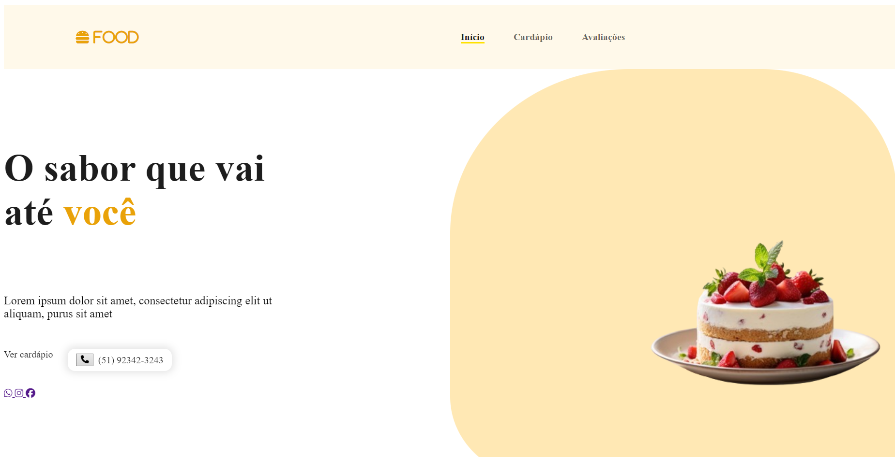
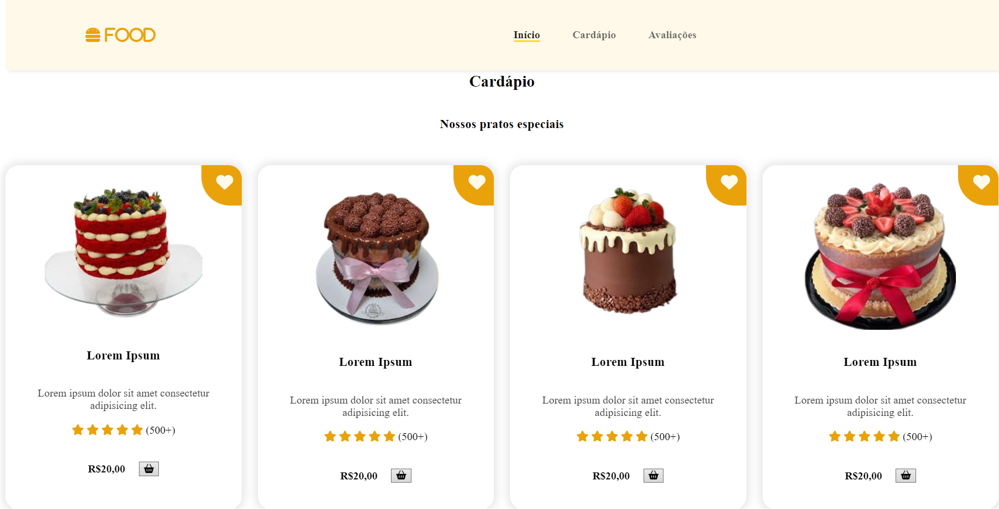

### Descrição:
O repositório ProjCake armazena o Projeto CAKE, um site, o tal tem como objetivo demonstrar um modelo de site com o tema confeitaria, cujo está divulgando seus serviços. Este projeto foi elaborado junto do professor no Curso Técnico de Informática do Colégio ULBRA São Lucas.

## Ficha Ténica:

Desenvolvedor(a): @eduardahermannalmeida 

Linguagens:

Software:

Ícones:

https://www.iconfinder.com

Header/Footer:

https://leviarista.github.io/github-profile-header-generator/

## Preview:

